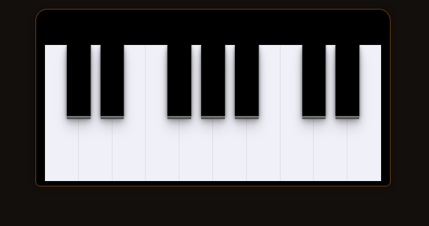

<h1 align="center"> Musical Keyboard </h1>

Curso de Manipulação da DOM com JS realizado pela Rocketseat.

  <a href="#-tecnologias">Tecnologias</a>&nbsp;&nbsp;&nbsp;|&nbsp;&nbsp;&nbsp;
  <a href="#-projeto">Projeto</a>&nbsp;&nbsp;&nbsp;|&nbsp;&nbsp;&nbsp;
  <a href="#-layout">Layout</a>&nbsp;&nbsp;&nbsp;|&nbsp;&nbsp;&nbsp;
  <a href="#memo-licença">Licença</a>

  

  

 

---

 

## 💻 Tecnologias

Esse projeto foi desenvolvido com as seguintes tecnologias:

- HTML e CSS
- JavaScript

 

## 📚 Projeto

O **Musical Keyboard** é uma aplicação web que permite tocar notas musicais de um teclado musical.

 

## 🔖 Layout

Você pode visualizar o layout do projeto através [desse link](https://musicalkeyboard-caps.netlify.app).

 

## 📄 Licença

Esse projeto está sob a licença MIT.

